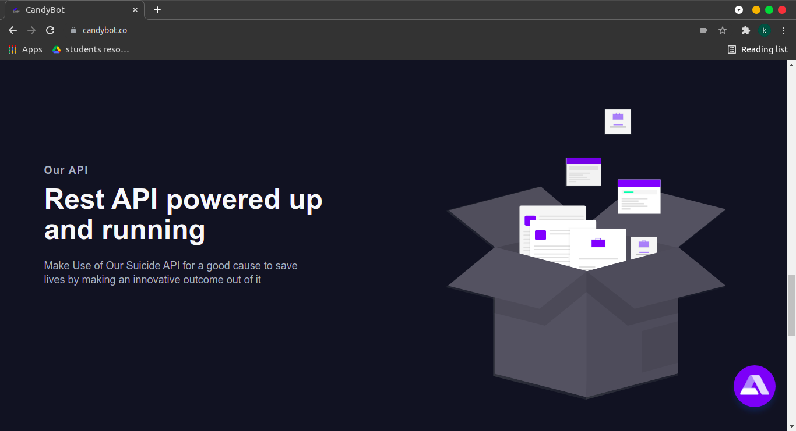

  

<h1 align="center">Hi , I am Candy Bot</h1>
<h3 align="center">On a mission to prevent Suicide</h3>

  <em>
   A lot of people are commiting <b>Suicide</b> in the recent years. So, we have made a chat bot to address this issue.
    We leverage the use of modern AI to make <b>Candy Bot</b> a chat bot that interacts well with you
    to understand your problem and say some good words to<b> make you smile</b>&nbsp;
    interact with it to <b>Learn more</b> 
  </em> 
   
   <b><i>Come On Lets Save Lives!!

<!-- 
  
 -->

[DEMO] https://www.candybot.co/  
[VIDEO DEMO] https://youtu.be/Byn2wzt79qA  
[API] https://candybotapi.pythonanywhere.com/api/Apis/  
  
&nbsp;*** Features***

✔ Modern **User Interface** with a **Sleek Design** 
✔ **AI powered Bot**  
✔ Custom Suicide Data **API** 
✔ Clean **Dynamic Data visualization**   
✔ Proper **Documentation**   
 
&nbsp;*** Context Chart***

&nbsp;*** Sample Designs***

 

  
   
  &nbsp;***Instructions***

  
  ✔ Clone the repository into your local system  
  ✔ For running the website `cd react-app` .  
  ✔ Installation of node modules to be done by `npm` or `yarn`  
  ✔ Run the website by `npm start` or `yarn start`  
   
  
&nbsp;***Languages & Tools We used***

  
  <code></code><code> 
   </code>
  <code>  </code>
  <code>  </code>
  <code>  </code><code>
   </code>
  <code>  </code>
  <code>  </code>
  <code>  </code>

